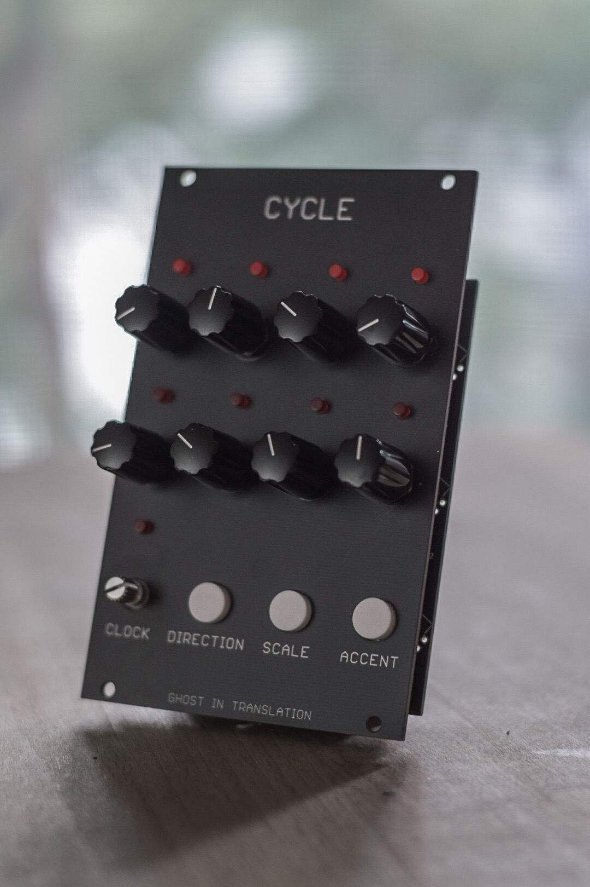
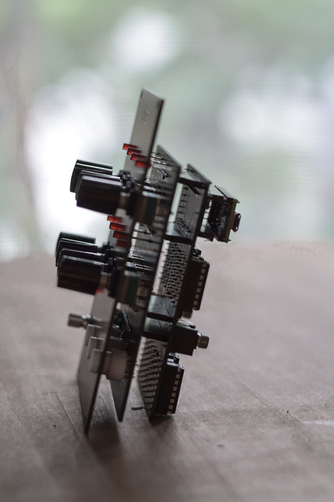

# cycle
CYCLE is a modular monophonic sequencer, based on eurorack physical format it has however no patch cables in the front but has rather midi jacks in the back.

It is based on [Motherboard12](https://github.com/ghostintranslation/motherboard12).

NOTE: This is a work in progress.




## Features
* 8 steps
* Forward, Backward, Pendulum, Transposer modes
* Scales
* Accents
* MIDI over USB
* MIDI over mini jack

## Getting Started

### Prerequisites

What things you need to make it work:

```
1 Teensy 4.0
1 MOTHERBOARD12A pcb
1 MOTHERBOARD9B pcb
1 CYCLE front panel pcb
8 vertical potentiometers 10K
1 vertical rotary encoder
9 LED
4 14 pins male header
6 14 pins female header
8 CD4051 multiplexers
8 DIP16 IC sockets (optionak)
2 3.5mm jack connectors
1 resistor ~ 80ohm
1 4 positions dipswitch (optional)
```

# How to use

Here is a description of the 6 inputs and what they do:

```
1. Default screen
    - Each pair of LED-Potentiometer represent a step.
    - The LED indicates when the step is active
    - The potentiometer sets the note of the step within 2 octaves
        - At 0 the note is muted
2. Clock
    1. Usage
        1. If MIDI clock is received                        (TODO)
            - The sequencer sync with the received tempo
            - The rotary acts as a clock divider selector
            - Turning the rotary will enter the Divider screen
        2. If no MIDI clock is received
            - The sequencer sends midi clock messages       (TODO)
            - The rotary sets the tempo from 10 to 200bpm
        3. Clicking will toggle Play
    2. Display
        - Tempo is indicaded by the LED above the Clock rotary
        - Divider screen                                    (TODO)
            - Turning the rotary will allow selection from no division to division by 16
            - Active selection is indicated by a blinking LED witin 8 solid lit LED
3. Direction
    1. Usage
        - Push once the Direction button to enter the Direction screen
        - Push again the button while in this screen to change the Direction
    2. Modes
        1. Forward,
        2. Backward
        3. Pendulum
            - Going forward and backward alternatively
        4. Forward Transposer                               (TODO)
            - The bar becomes 4 steps. The 4 steps at the top are being transposed by the 4 steps at the bottom. 
    3. Display
        - The selected direction is indicated by a blinking LED 
        - Screen stays 1s after last push
4. Scale                                                    (TODO)
    1. Usage
        - Push once the Scale button to enter the Scale screen
        - Push again the button while in this screen to change the Scale
        - Choose between no scale (first choice) and 7 scales
    2. Display
        - The selected scale is indicated by a blinking LED 
        - Screen stays 1s after last push
5. Accent                                                   (TODO)
    1. Usage
        - Push once the Accent button to enter the Accent screen
        - Push again the button while in this screen to toggle accent on the active step
        - Long click will reset all accents
    2. Display
        - The active step is indicated by a blinking LED 
        - Steps with accents are indicated by a solid lit LED
        - Screen stays 2s after last push
```

## About me
You can find me on Bandcamp and Instagram:

https://ghostintranslation.bandcamp.com/

https://www.instagram.com/ghostintranslation/

https://www.youtube.com/channel/UCcyUTGTM-hGLIz4194Inxyw

https://www.ghostintranslation.com/


## License

This project is licensed under the MIT License - see the [LICENSE.md](LICENSE.md) file for details